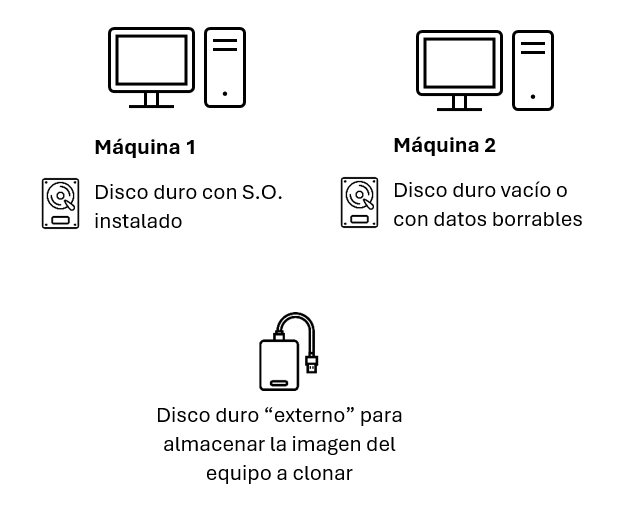

# PRÁCTICA: CLONADO Y RESTAURACIÓN DE SISTEMAS CON CLONEZILLA

## 1. ¿QUÉ ES CLONEZILLA?

### Definición

**Clonezilla** es un software libre y gratuito de clonación y restauración de discos y particiones. Funciona de manera similar a Norton Ghost o Acronis True Image, pero es completamente gratuito y de código abierto.

### Características principales

#### Ventajas
✓ **Gratuito y de código abierto**\
✓ **Soporta múltiples sistemas de archivos:** ext2, ext3, ext4, FAT, NTFS, HFS+, etc.\
✓ **Clona solo bloques usados** (ahorra espacio y tiempo)\
✓ **Compresión de imágenes** para ahorrar espacio\
✓ **Diferentes modos de clonación:** disco a disco, disco a imagen\
✓ **Multicast** para clonar múltiples equipos simultáneamente\
✓ **Arranque desde USB o CD/DVD**

#### Limitaciones
✗ Interfaz en modo texto (puede resultar intimidante al principio)\
✗ No permite operaciones en caliente (el sistema debe estar apagado)\
✗ Requiere conocimientos básicos de particiones y sistemas de archivos

### Versiones de Clonezilla

#### Clonezilla Live
- **Uso:** Un solo equipo
- **Distribución:** ISO para CD/DVD/USB
- **Ideal para:** Usuarios domésticos, técnicos, laboratorios pequeños

#### Clonezilla SE (Server Edition)
- **Uso:** Múltiples equipos simultáneamente (multicast)
- **Distribución:** Servidor dedicado
- **Ideal para:** Aulas de informática, empresas grandes

**En esta práctica usaremos Clonezilla Live**

### ¿Cuándo usar Clonezilla?

- **Copias de seguridad completas** del sistema
- **Migración de sistemas** a discos nuevos
- **Despliegue masivo** de sistemas operativos
- **Recuperación ante desastres**
- **Clonación de laboratorios** informáticos
- **Actualización de hardware** (disco duro a SSD)

---

## 2. PREPARACIÓN DEL ENTORNO

### Escenario de práctica

Para esta práctica utilizaremos **VirtualBox** con el siguiente esquema:



---

## 3. DESCARGA E INSTALACIÓN DE CLONEZILLA

### Paso 1: Descargar Clonezilla Live

Descarga la ISO de Clonezilla del servidor de aula

### Paso 2: Montar ISO en VirtualBox

#### En la máquina origen
1. Con la VM apagada, ve a **Configuración → Almacenamiento**
2. Haz clic en el icono de CD (vacío)
3. En el menú de la derecha, haz clic en el icono de CD
4. Selecciona **Elegir archivo de disco**
5. Busca y selecciona la ISO de Clonezilla
6. Acepta los cambios

### Paso 3: Configurar orden de arranque

1. En VirtualBox: **Configuración → Sistema → Orden de arranque**
2. Asegúrate de que **Óptico** está antes que **Disco duro**
3. O usa el **menú de arranque** (F12 durante el inicio de la VM)

---

## 4. PRÁCTICA 1: CLONAR DISCO/PARTICIÓN A IMAGEN

### Objetivo
Crear una imagen de respaldo del disco completo de nuestra máquina virtual.

### Paso 1: Arrancar Clonezilla

1. **Inicia la máquina virtual**
   - Debería arrancar desde la ISO de Clonezilla

2. **Primera pantalla: Selección de idioma**
   - Se muestra el menú de arranque de Clonezilla
   - Espera 30 segundos o presiona Enter para la opción por defecto
   - Opción recomendada: **Clonezilla live (Default settings, VGA 800x600)**

3. **Seleccionar idioma**
   - Usa las flechas del teclado
   - Selecciona **Español** o **English** (según prefieras)
   - Presiona **Enter**

4. **Seleccionar distribución de teclado**
   - Selecciona **Don't touch keymap** (no cambiar distribución)
   - O elige tu distribución específica
   - Presiona **Enter**

5. **Iniciar Clonezilla**
   - Se mostrará: "Start Clonezilla"
   - Presiona **Enter**

### Paso 2: Modo de Clonezilla

Como queremos crear la imagen del disco de la máquina elegiremos la opción `device-image` (disco/partición a imagen)

### Paso 3: Ubicación para guardar la imagen

Clonezilla nos pregunta dónde guardar la imagen. En nuestro caso vamos a utilizar el disco local (disco externo simulado) que hemos conectado en el proceso de configuración de la máquina virtual de origen. Por lo tanto seleccionamos la opción `local_dev` (dispositivo local).

### Paso 4: Montar dispositivo de almacenamiento

1. **Insertar dispositivo**
   - El sistema pide que insertes el USB/disco externo donde guardar la imagen. Como ya lo tenemos conectado previamente, no debemos hacer nada.
   - Presiona **Enter** cuando esté listo

2. **Espera a que detecte los dispositivos**
   - Clonezilla buscará dispositivos disponibles
   - Aparecerá una lista de particiones disponibles

3. **Seleccionar partición de destino**
   - Verás algo como:
     ```
     sda1  vfat  500M
     sda2  ext4  19.5G  ← (tu disco principal)
     sdb1  ntfs  128G   ← (disco externo adicional)
     ```
   - **Selecciona** la partición correspondiente al disco externo. En este ejemplo será `sdb1`
   - **Presiona:** Enter

4. **Confirmar directorio**
   - Clonezilla montará la partición
   - Preguntará el directorio donde guardar las imágenes
   - Por defecto sugiere la raíz: `/home/partimag`
   - **Presiona:** Enter para aceptar o escribe una ruta personalizada

5. **Verificación**
   - Mostrará información sobre el espacio disponible
   - **Presiona:** Enter para continuar

### Paso 5: Modo de operación

Para esta práctica utilizaremos el modo `Beginner` (modo principiante).

### Paso 6: Tipo de clonación

Como queremos hacer la imagen del disco completo seleccionaremos la opción `savedisk` (guardar disco completo como imagen). 

**Nota:** También podrías usar `saveparts` si solo quieres clonar una partición específica.

### Paso 7: Nombre de la imagen

1. **Introducir nombre**
   - Se pedirá un nombre para la imagen
   - Sugerencia: `img-equipo1-2025-11-07` (usa fecha y descripción)
   - **Escribe** el nombre
   - **Presiona:** Enter

### Paso 8: Seleccionar disco origen

Aparecerá lista de discos disponibles:

```
┌──────────────────────────────────────┐
│ [ ] sda  20GB                        │
│ [ ] sdb  20GB                        │
└──────────────────────────────────────┘
```

1. **Selecciona** el disco que quieres clonar (normalmente sda)
2. Usa **barra espaciadora** para marcar/desmarcar
3. **Presiona:** Enter cuando esté seleccionado

### Paso 9: Verificar imagen

```
┌──────────────────────────────────────┐
│ -sfsck  Skip checking/repairing file │
│         system                       │
│ -fsck-src-part  Check/repair source  │
│                 file system          │
└──────────────────────────────────────┘
```

**Selecciona:** `-fsck-src-part` (verificar sistema de archivos)
**Presiona:** Enter

Esto asegura que no hay errores antes de clonar.

### Paso 10: Verificar imagen guardada

```
┌──────────────────────────────────────┐
│ -scs  Skip checking the image       │
│ -sc   Check the image after saving  │
└──────────────────────────────────────┘
```

**Selecciona:** `-sc` (verificar la imagen después de guardarla)
**Presiona:** Enter

Esto confirma que la imagen se guardó correctamente.

### Paso 11: Acción después de finalizar

```
┌──────────────────────────────────────┐
│ -p choose  Choose action after save │
│ -p true    Shutdown after save      │
│ -p reboot  Reboot after save        │
└──────────────────────────────────────┘
```

**Selecciona:** `-p choose` (elegir acción al finalizar)
**Presiona:** Enter

### Paso 12: Confirmar y ejecutar

1. **Resumen de operación**
   - Clonezilla mostrará un resumen de la operación
   - Revisa cuidadosamente:
     - Disco origen
     - Ubicación destino
     - Nombre de imagen
     - Opciones seleccionadas

2. **Primera confirmación**
   - Pregunta: "Are you sure you want to continue? (y/n)"
   - **Escribe:** `y`
   - **Presiona:** Enter

3. **Segunda confirmación**
   - Pregunta nuevamente para estar seguro
   - **Escribe:** `y`
   - **Presiona:** Enter

### Paso 13: Proceso de clonación

1. **Verificación del sistema de archivos**
   - Clonezilla verificará el sistema de archivos origen
   - Mostrará el progreso

2. **Clonación en progreso**
   - Verás una barra de progreso
   - Información mostrada:
     ```
     Current  rate: XXX MB/min
     Avg. rate: XXX MB/min
     Elapsed time: XX:XX:XX
     Remaining time: XX:XX:XX
     ```

3. **Compresión**
   - Los datos se comprimen automáticamente
   - Reduce el tamaño de la imagen

4. **Verificación** (si elegiste esta opción)
   - Al terminar la clonación, verifica la integridad
   - Puede tardar algunos minutos adicionales

5. **Finalización**
   - Mensaje: "The disk or partition image was saved successfully!"
   - **Presiona:** Enter

### Paso 14: Acción posterior

Dependiendo de lo que elegiste:
- **Choose:** Te preguntará qué hacer (apagar, reiniciar, línea de comandos)
- Selecciona: `poweroff` (apagar)
- **Presiona:** Enter

### Resultado esperado

Deberías tener en la ubicación seleccionada:
```
/home/partimag/2024-11-05-archlinux-disk/
├── blkdev.list
├── clonezilla-img
├── disk
├── Info-dmi.txt
├── Info-lshw.txt
├── Info-packages.txt
├── Info-saved-by-cmd
├── parts
├── sda-chs.sf
├── sda-gpt-1st
├── sda-gpt-2nd
├── sda-gpt.gdisk
├── sda-hidden-data-after-mbr
├── sda-mbr
├── sda-pt.parted
├── sda-pt.sf
├── sda1.ext4-ptcl-img.gz.aa
├── sda2.ext4-ptcl-img.gz.aa
└── sda2.ext4-ptcl-img.gz.ab
```

---

## 5. PRÁCTICA 2: RESTAURAR IMAGEN A DISCO/PARTICIÓN

### Objetivo
Restaurar la imagen de respaldo creada anteriormente a un disco (puede ser el mismo u otro).

### Tiempo estimado: 45 minutos

### Preparación

**⚠️ ADVERTENCIA:** Este proceso **sobrescribirá completamente** el disco destino. Asegúrate de:
- Estar restaurando en el disco correcto
- Haber hecho backup de cualquier dato importante
- El disco destino tiene espacio suficiente

Para practicar sin riesgo:
- Usa el segundo disco que añadiste a la VM
- O crea una nueva VM vacía

### Paso 1: Arrancar Clonezilla

1. Arranca la máquina virtual con Clonezilla
2. Sigue los pasos iniciales (idioma, teclado, iniciar Clonezilla)

### Paso 2: Modo de Clonezilla

**Selecciona:** `device-image` (disco/partición desde imagen)
**Presiona:** Enter

### Paso 3: Ubicación de la imagen

**Selecciona:** `local_dev` (dispositivo local)
**Presiona:** Enter

### Paso 4: Montar dispositivo con la imagen

1. Presiona **Enter** para buscar dispositivos
2. **Selecciona** la partición donde guardaste la imagen (ej: sdb1)
3. **Presiona:** Enter
4. **Confirma** el directorio `/home/partimag`
5. **Presiona:** Enter

Deberías ver listada tu imagen:
```
2024-11-05-archlinux-disk
```

### Paso 5: Modo de operación

**Selecciona:** `Beginner` (modo principiante)
**Presiona:** Enter

### Paso 6: Tipo de restauración

**Selecciona:** `restoredisk` (restaurar imagen a disco local)
**Presiona:** Enter

### Paso 7: Seleccionar imagen a restaurar

Aparecerá lista de imágenes disponibles:

```
┌──────────────────────────────────────┐
│ [ ] 2024-11-05-archlinux-disk        │
└──────────────────────────────────────┘
```

1. **Selecciona** la imagen con las flechas
2. **Presiona:** Enter

### Paso 8: Seleccionar disco destino

⚠️ **MUY IMPORTANTE:** Asegúrate de seleccionar el disco correcto

```
┌──────────────────────────────────────┐
│ [ ] sda  20GB  (disco original)      │
│ [ ] sdb  20GB  (disco vacío)         │
└──────────────────────────────────────┘
```

**Para esta práctica:**
- Si quieres sobrescribir el original: selecciona `sda`
- Si quieres restaurar en el disco vacío: selecciona `sdb`

**Presiona:** Enter

### Paso 9: Opciones adicionales

Similar a la clonación:

1. **Verificar/reparar:** Selecciona `-fsck-src-part` o `-sfsck` (skip)
2. **Acción posterior:** Selecciona `-p choose`

### Paso 10: Confirmar y ejecutar

1. **Revisar resumen**
   - Imagen origen
   - Disco destino
   - **¡Verifica que sea el disco correcto!**

2. **Primera confirmación**
   - **Escribe:** `y`
   - **Presiona:** Enter

3. **Segunda confirmación**
   - **Escribe:** `y`
   - **Presiona:** Enter

4. **Tercera confirmación (crítica)**
   - Si va a sobrescribir datos existentes, pedirá confirmación adicional
   - **Escribe:** `y`
   - **Presiona:** Enter

### Paso 11: Proceso de restauración

1. **Descompresión y escritura**
   - Clonezilla descomprime y escribe los datos
   - Verás progreso similar a la clonación

2. **Restauración de particiones**
   - Se restauran todas las particiones
   - Se recrea el MBR/GPT

3. **Finalización**
   - Mensaje: "The disk or partition was restored successfully!"

4. **Acción posterior**
   - Selecciona apagar o reiniciar
   - Si reiniciais, **quita la ISO** de Clonezilla para arrancar del disco restaurado

### Verificación

1. **Retira la ISO de Clonezilla** de la configuración de VirtualBox
2. **Arranca** la máquina virtual
3. **Verifica** que el sistema arranca correctamente
4. **Comprueba** que todos los archivos y configuraciones están presentes

---

## 6. PRÁCTICA 3: CLONADO DISCO A DISCO

### Objetivo
Clonar directamente un disco a otro sin crear archivo de imagen intermedio.

### Ventajas de disco a disco
✓ Más rápido (no hay compresión/descompresión)
✓ No requiere espacio adicional para imagen
✓ Ideal para migrar a disco nuevo

### Desventajas
✗ No tienes archivo de backup
✗ Requiere ambos discos conectados simultáneamente

### Tiempo estimado: 30 minutos

### Preparación

Asegúrate de tener en VirtualBox:
- **Disco origen** (sda): Con el sistema operativo
- **Disco destino** (sdb): Vacío, igual o mayor tamaño

### Paso 1-4: Arranque inicial

1. Arranca Clonezilla
2. Configura idioma y teclado
3. Inicia Clonezilla

### Paso 5: Modo de Clonezilla

**IMPORTANTE:** Esta vez es diferente

**Selecciona:** `device-device` (disco/partición a disco/partición directamente)
**Presiona:** Enter

### Paso 6: Modo de operación

**Selecciona:** `Beginner`
**Presiona:** Enter

### Paso 7: Tipo de clonación directa

```
┌──────────────────────────────────────┐
│ disk_to_local_disk                   │
│ part_to_local_part                   │
└──────────────────────────────────────┘
```

**Selecciona:** `disk_to_local_disk` (disco a disco local)
**Presiona:** Enter

### Paso 8: Seleccionar disco origen

```
┌──────────────────────────────────────┐
│ [ ] sda  20GB  ← (tu sistema)        │
│ [ ] sdb  20GB  ← (vacío)             │
└──────────────────────────────────────┘
```

**Selecciona:** `sda` (disco con el sistema)
**Presiona:** Enter

### Paso 9: Seleccionar disco destino

⚠️ **CUIDADO:** Se borrará TODO el contenido del disco destino

**Selecciona:** `sdb` (disco vacío)
**Presiona:** Enter

### Paso 10: Opciones avanzadas (opcional)

Clonezilla puede preguntar opciones adicionales:

```
┌──────────────────────────────────────┐
│ -k  Create partition table on target │
│ -k0 Do NOT create partition table    │
│ -k1 Create partition table (default) │
└──────────────────────────────────────┘
```

**Recomendado:** `-k1` (crear tabla de particiones)
**Presiona:** Enter

### Paso 11: Confirmar y ejecutar

1. **Resumen de operación**
   - Origen: sda
   - Destino: sdb
   - **¡Verifica cuidadosamente!**

2. **Confirmación**
   - Escribir `y` dos veces
   - **Presiona:** Enter cada vez

### Paso 12: Proceso de clonación

1. **Clonación en progreso**
   - Clonezilla copia bit a bit los datos
   - Más rápido que crear imagen
   - Verás progreso en tiempo real

2. **Finalización**
   - Mensaje de éxito
   - El disco destino es ahora una copia exacta del origen

### Verificación

1. **Apaga la VM**
2. **Cambia el orden de arranque** para que arranque desde sdb
   - O desconecta temporalmente sda
3. **Arranca y verifica** que el sistema funciona correctamente

---

## 7. CASOS DE USO PRÁCTICOS

### Caso 1: Backup periódico del sistema

**Situación:** Quieres hacer backups regulares de tu sistema.

**Procedimiento:**
1. Cada semana/mes, arranca con Clonezilla
2. Crea imagen con nombre que incluya fecha: `2024-11-05-backup-semanal`
3. Guarda en disco externo o NAS
4. Mantén las últimas 3-4 imágenes, borra las antiguas

**Ventajas:**
- Puedes volver a cualquier punto en el tiempo
- Protección ante fallos de hardware
- Recuperación rápida

### Caso 2: Migración a SSD

**Situación:** Quieres migrar tu sistema de HDD a SSD.

**Procedimiento:**
1. Conecta el SSD nuevo como segundo disco
2. Usa Clonezilla en modo disco a disco
3. Clona HDD → SSD
4. Cambia el SSD como disco principal
5. Verifica que todo funciona
6. Formatea el HDD para usarlo como almacenamiento adicional

**Nota:** El SSD debe ser igual o mayor que el espacio usado en el HDD.

### Caso 3: Despliegue de laboratorio informático

**Situación:** Necesitas instalar el mismo sistema en 30 ordenadores.

**Procedimiento con Clonezilla Live:**
1. Configura un equipo "maestro" con todo el software necesario
2. Crea una imagen con Clonezilla
3. Guarda la imagen en un USB o servidor
4. Para cada ordenador:
   - Arranca con Clonezilla
   - Restaura la imagen
   - Personaliza (nombre de equipo, IP, etc.)

**Procedimiento con Clonezilla SE (más avanzado):**
1. Monta servidor Clonezilla SE
2. Configura multicast
3. Arranca todos los equipos simultáneamente
4. Se clonan todos a la vez (ahorra mucho tiempo)

### Caso 4: Recuperación ante desastre

**Situación:** El sistema se ha corrompido o infectado con malware.

**Procedimiento:**
1. Arranca con Clonezilla
2. Restaura la última imagen limpia
3. Sistema recuperado en minutos/horas (vs. horas/días reinstalando)

**Buenas prácticas:**
- Mantén backups antes de actualizaciones importantes
- Guarda backups en ubicaciones separadas
- Verifica periódicamente que las imágenes son restaurables

### Caso 5: Pruebas de software

**Situación:** Necesitas probar software que podría dañar el sistema.

**Procedimiento:**
1. Crea imagen del sistema limpio
2. Instala/prueba el software
3. Si hay problemas: restaura la imagen
4. Sistema vuelve al estado anterior

**Ideal para:**
- Probar versiones beta
- Experimentar con configuraciones
- Prácticas de estudiantes

---

## 8. PREGUNTAS DE EVALUACIÓN

### Preguntas teóricas

**1. ¿Qué es Clonezilla y para qué se utiliza?**

_________________________________________________________________

_________________________________________________________________

**2. Menciona 3 ventajas de Clonezilla sobre otras herramientas comerciales.**

_________________________________________________________________

_________________________________________________________________

**3. ¿Cuál es la diferencia entre "device-image" y "device-device"?**

_________________________________________________________________

_________________________________________________________________

**4. ¿Por qué Clonezilla solo clona los bloques usados y no todo el disco?**

_________________________________________________________________

_________________________________________________________________

**5. ¿Qué significa que una imagen esté comprimida? ¿Qué ventajas tiene?**

_________________________________________________________________

_________________________________________________________________

**6. ¿Cuándo es preferible usar clonación disco a disco en lugar de crear una imagen?**

_________________________________________________________________

_________________________________________________________________

**7. ¿Qué precauciones debes tomar antes de restaurar una imagen en un disco?**

_________________________________________________________________

_________________________________________________________________

**8. ¿Qué información contiene la carpeta de una imagen de Clonezilla además de los datos del disco?**

_________________________________________________________________

_________________________________________________________________

### Preguntas prácticas

**9. Completa la siguiente tabla comparativa:**

| Característica | Clonación a Imagen | Clonación Disco a Disco |
|----------------|-------------------|------------------------|
| Velocidad | | |
| Espacio necesario | | |
| ¿Permite backup? | | |
| Discos simultáneos | | |
| Uso recomendado | | |

**10. Ordena los pasos para clonar un disco a imagen:**

- [ ] Seleccionar disco origen
- [ ] Arrancar Clonezilla Live
- [ ] Elegir ubicación para guardar imagen
- [ ] Confirmar la operación
- [ ] Seleccionar modo device-image
- [ ] Introducir nombre de la imagen
- [ ] Configurar idioma y teclado

**11. Situación práctica: Migración a nuevo disco**

Tu ordenador tiene un disco duro de 500 GB con 300 GB usados. Has comprado un SSD de 480 GB.

a) ¿Puedes clonar directamente el disco HDD al SSD? ¿Por qué?

_________________________________________________________________

b) ¿Qué método de Clonezilla usarías?

_________________________________________________________________

c) ¿Qué pasos adicionales necesitarías realizar antes de clonar?

_________________________________________________________________

**12. Situación práctica: Backup del sistema**

Quieres hacer un backup completo de tu sistema antes de instalar actualizaciones importantes.

a) ¿Qué modo de Clonezilla usarías?

_________________________________________________________________

b) ¿Dónde guardarías la imagen? (menciona al menos 2 opciones)

_________________________________________________________________

c) ¿Qué nombre le pondrías a la imagen?

_________________________________________________________________

**13. Análisis de error**

Intentas restaurar una imagen de 80 GB en un disco de 60 GB. ¿Qué sucederá?

_________________________________________________________________

_________________________________________________________________

**14. Caso práctico: Laboratorio de informática**

Tienes que configurar 20 ordenadores idénticos para un aula de informática.

a) Describe el proceso completo usando Clonezilla

_________________________________________________________________

_________________________________________________________________

_________________________________________________________________

b) ¿Cuánto tiempo aproximado te llevaría vs. instalar manualmente cada equipo?

_________________________________________________________________

**15. Resolución de problemas**

Has creado una imagen de tu disco de 100 GB, pero la imagen resultante ocupa solo 45 GB. ¿Es esto normal? ¿Por qué?

_________________________________________________________________

_________________________________________________________________

---

## 9. CONSEJOS Y BUENAS PRÁCTICAS

### Antes de clonar

✓ **Verifica el espacio disponible**
- Asegúrate de tener suficiente espacio para la imagen
- Regla general: reserva espacio igual al 50-70% del tamaño usado del disco

✓ **Limpia el sistema origen**
- Elimina archivos temporales
- Vacía la papelera de reciclaje
- Desinstala programas innecesarios
- Esto reduce el tamaño de la imagen

✓ **Verifica la integridad del disco**
- En Windows: `chkdsk /f`
- En Linux: `fsck`
- Corrige errores antes de clonar

✓ **Haz una lista de verificación**
- Anota qué disco es origen y cuál destino
- Verifica números de serie si es necesario
- Previene errores costosos

### Durante la clonación

✓ **No interrumpas el proceso**
- No apagues el ordenador
- No desconectes discos
- Espera a que finalice completamente

✓ **Conecta el equipo a corriente**
- En portátiles, conecta el cargador
- Evita que se apague por batería

✓ **Supervisa el proceso**
- Verifica que no hay errores
- Anota el tiempo que tarda (para futuras referencias)

### Después de clonar

✓ **Verifica la imagen/disco clonado**
- Arranca desde el disco clonado
- Comprueba que todo funciona
- Verifica archivos importantes

✓ **Etiqueta correctamente**
- Imagen: Nombre descriptivo con fecha
- Disco físico: Etiqueta física adherida
- Documenta qué contiene cada imagen

✓ **Almacena backups de forma segura**
- En ubicación diferente al ordenador original
- Protegido de humedad, calor, campos magnéticos
- Considera cifrado para datos sensibles

✓ **Establece calendario de backups**
- Semanal: Para datos críticos
- Mensual: Para sistemas estables
- Antes de cambios importantes: Siempre

### Gestión de imágenes

✓ **Esquema de nombres consistente**
```
Formato sugerido:
YYYY-MM-DD-Descripcion-Version

Ejemplos:
2024-11-05-Windows10-Oficina-v1
2024-11-05-ArchLinux-Desarrollo-v2
2024-11-12-UbuntuServer-Produccion-v1
```

✓ **Rotación de backups**
- Mantén las últimas 3-5 imágenes
- Elimina las más antiguas periódicamente
- Balancea espacio vs. historial

✓ **Documentación**
- Crea un archivo README.txt con cada imagen
- Incluye: fecha, contenido, configuración especial, contraseñas (si las cambias)

### Seguridad

✓ **Cifrado de imágenes sensibles**
- Clonezilla soporta cifrado con `-e` (modo experto)
- Usa contraseñas fuertes
- Guarda la contraseña en lugar seguro

✓ **Verificación de integridad**
- Siempre activa la verificación de imagen
- Compara checksums periódicamente
- Detecta corrupción tempranamente

✓ **Control de acceso**
- Protege el acceso físico a los backups
- Permisos adecuados en carpetas de red
- Considera encriptación de disco para almacenar imágenes

---

## 10. RESOLUCIÓN DE PROBLEMAS COMUNES

### Problema 1: No detecta el disco/partición destino

**Síntomas:**
- No aparece en la lista de dispositivos
- Error de montaje

**Soluciones:**
1. Verifica que el disco esté correctamente conectado
2. En VirtualBox: Asegúrate de que el disco virtual está añadido
3. Reinicia Clonezilla y vuelve a buscar dispositivos
4. Verifica el sistema de archivos (debe ser compatible)

### Problema 2: Error de espacio insuficiente

**Síntomas:**
- "Not enough space"
- Clonación se detiene a mitad

**Soluciones:**
1. Limpia el disco origen antes de clonar
2. Usa un destino con más espacio
3. Divide la clonación en particiones individuales
4. Aumenta la compresión (modo experto)

### Problema 3: El sistema no arranca después de restaurar

**Síntomas:**
- Error de boot
- Pantalla negra
- "Operating system not found"

**Soluciones:**
1. Verifica que restauraste en el disco correcto
2. Comprueba el orden de arranque en BIOS/UEFI
3. En VirtualBox: Verifica que el disco esté marcado como booteable
4. Repara el gestor de arranque:
   - Windows: `bootrec /fixmbr` y `bootrec /fixboot`
   - Linux: Reinstala GRUB

### Problema 4: Imagen corrupta o no se puede restaurar

**Síntomas:**
- Error al restaurar
- Verificación falla
- Archivos de imagen dañados

**Soluciones:**
1. Verifica el checksum de la imagen
2. Intenta restaurar desde un backup anterior
3. Usa herramientas de recuperación de datos
4. En el futuro: Siempre verifica la imagen después de crearla

### Problema 5: Clonación extremadamente lenta

**Síntomas:**
- Tarda horas para discos pequeños
- Velocidad muy baja (< 100 MB/min)

**Posibles causas y soluciones:**
1. **Disco origen con errores**
   - Solución: Verifica y repara el disco antes de clonar
2. **USB 2.0 en lugar de USB 3.0**
   - Solución: Usa puerto USB 3.0 (azul)
3. **Fragmentación excesiva**
   - Solución: Desfragmenta antes de clonar (solo HDD)
4. **Sectores defectuosos**
   - Solución: Usa la opción `-rescue` en modo experto

### Problema 6: La imagen es demasiado grande

**Síntomas:**
- Imagen mayor de lo esperado
- No cabe en el destino

**Soluciones:**
1. Limpia archivos innecesarios del origen
2. Elimina puntos de restauración de Windows
3. Usa mayor compresión (modo experto: `-z9`)
4. Clona solo las particiones necesarias (no todo el disco)

---
